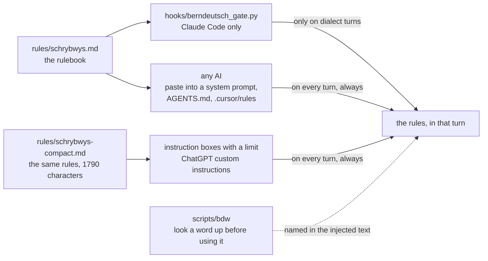
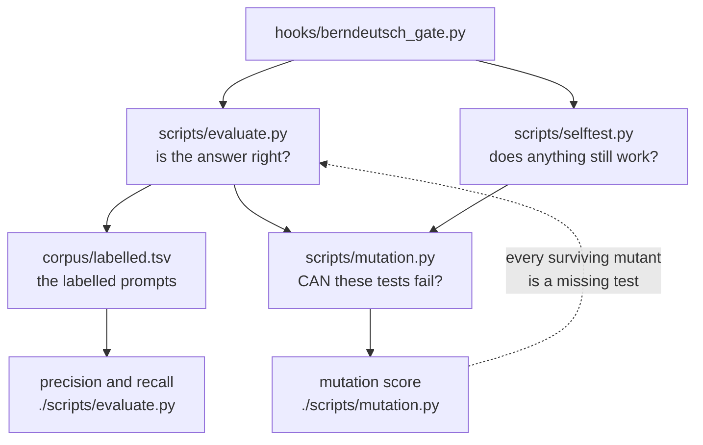
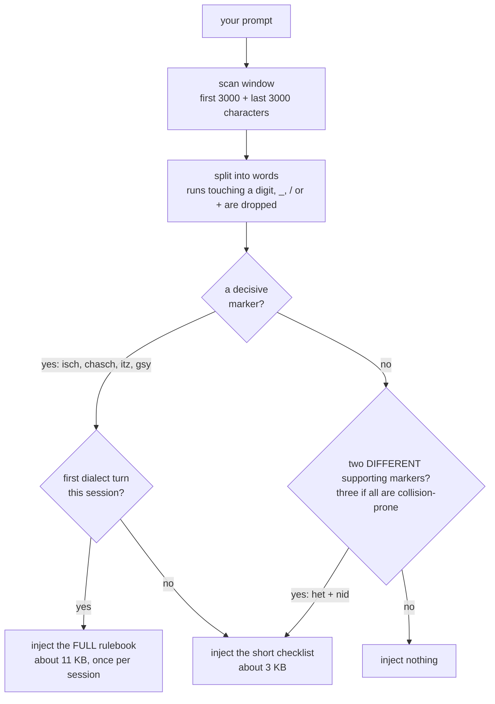

# berndeutsch-for-ai

**Bärndütsch for AI.**

A rulebook that makes any AI write real Bernese German, instead of a generic
Swiss German that drifts a little further toward Zurich every session.

> **Work in progress.** This is a 0.x release and it is being actively worked
> on. The rulebook itself is stable enough to use — it summarises a published
> spelling system, and `NOTICE` says exactly whose. The detector around it is
> not finished: the marker lists still move, the thresholds are still being
> tuned, and a release can change how the hook decides. Expect breaking
> changes between minor versions until 1.0.
>
> What that means in practice: pasting `rules/schrybwys.md` into any AI is safe
> and does not depend on any of this. If you install the hook, pin a version
> rather than tracking `main`, and re-read this file when you upgrade.
>
> Corrections to the Bernese itself are the most useful thing anyone can send.

Write to an AI in Bärndütsch and it will answer in something dialect-shaped.
Over a long conversation that something decays: `nöd` creeps in for `nid`, `ä`
inflates everywhere (`Gipfäli`), and words get invented on the spot because they
sound plausible. The cause is mundane. Whatever spelling rules you gave the model
live in a memory or a preferences file that is only sometimes in context. When
they are absent, the model falls back on its generic Swiss German prior.

**The rulebook works with any AI.** `rules/schrybwys.md` is a plain markdown file
with no tool-specific syntax, and `rules/schrybwys-compact.md` holds the same
rules in a 1790-character block for instruction boxes that impose a limit. Drop
either into a system prompt, custom instructions, `AGENTS.md`,
`.github/copilot-instructions.md` or `.cursor/rules/` and you are done.

**For Claude Code there is also a hook**, which removes the "sometimes"
entirely. `UserPromptSubmit` checks each prompt for Bernese markers and, when it
finds them, injects the rules into that turn. Deterministically, every time, and
silently on prompts that are not in dialect.

```
you:     hesch mer chönne luege wies mitem Modul steit?
hook:    [detects Bärndütsch] -> injects rules/schrybwys.md
claude:  answers in Bärndütsch, with nid instead of nöd
```

## What is in the box

| | |
|---|---|
| `rules/schrybwys.md` | The rulebook. The codified *schriftsprach-nah* system after Marti and Bietenhard: vowels, consonants, `ds`/`z`, grammar, and what separates Bernese from its neighbours. Tool-agnostic. |
| `rules/schrybwys-compact.md` | The same rules in 1790 characters, with attribution and licence inside the block. |
| `hooks/berndeutsch_gate.py` | The detector and injector, for Claude Code. |
| `scripts/bdw` | Dictionary lookup against berndeutsch.ch. Answers the question the model cannot answer honestly by itself: is this actually a word? |
| `scripts/bd-corpus` | Fetches a small corpus of genuinely Bernese text, for feel rather than rules. |
| `corpus/sources.md` | Where to read real Bernese, with licences. |
| `scripts/pdf-overlap` | Measures what the rulebook shares with the CC BY-ND source, so `NOTICE` quotes a number instead of a guess. |
| `scripts/selftest.py` | The regression suite. Every check in it is a bug that shipped. |
| `corpus/labelled.tsv` | The labelled evaluation set. The detector is a classifier, so it gets measured like one. |
| `scripts/evaluate.py` | Precision, recall, metamorphic relations, threshold probes. |
| `scripts/mutation.py` | Mutation score: whether the tests can fail at all. |
| `NOTICE` | Who wrote what this repository summarises, and under which licence. |

## How the pieces fit together

The rulebook is the product. Everything else is a way of getting it in front of
a model at the right moment.



The only difference between the paths is *when* the rules are present. Pasted
instructions sit in context on every unrelated turn; the hook injects them on
the turns that are in dialect and stays quiet otherwise.

## Use it with any AI

The rulebook is the product; the hook is one delivery mechanism. Nothing in
`rules/` is Claude-specific.

| Where | What to do |
|---|---|
| **ChatGPT** | Custom instructions, or a Project's instructions. Paste the block from `rules/schrybwys-compact.md`, i.e. everything below the `---`. |
| **Any system prompt / API** | Paste `rules/schrybwys.md` verbatim. |
| **GitHub Copilot** | `.github/copilot-instructions.md` |
| **Cursor / Windsurf** | `.cursor/rules/berndeutsch.md` |
| **Codex, and anything reading `AGENTS.md`** | Append it to `AGENTS.md`. |
| **Claude, without the hook** | `~/.claude/CLAUDE.md`, or `/memory`. |
| **Claude Code, with the hook** | See below. Only this one is conditional and automatic. |

The difference the hook makes is *when* the rules are present. Pasted
instructions sit in context on every unrelated turn, competing with everything
else in the prompt. The hook injects them only on the turns that are in dialect.

## Install the Claude Code hook

**As a plugin**

```
/plugin marketplace add sapn95/berndeutsch-for-ai
/plugin install berndeutsch-for-ai
```

**By hand**, which is the path this repo was developed and tested on:

```bash
git clone https://github.com/sapn95/berndeutsch-for-ai.git
cd berndeutsch-for-ai && ./scripts/install.py
```

`install.py` symlinks the hook and `bdw` into your Claude config directory,
self-tests both the firing and the silent case, prints the settings block to
merge, makes those two scripts executable, and changes nothing else. It never writes `settings.json` for you: that
file is yours and usually already has hooks in it.

The block it prints uses the exec form, so the hook is spawned directly and no
shell re-interprets the path:

```json
{
  "hooks": {
    "UserPromptSubmit": [
      {
        "hooks": [
          {
            "type": "command",
            "command": "python3",
            "args": ["/Users/you/.claude/hooks/berndeutsch_gate.py"],
            "timeout": 10,
            "statusMessage": "Bärndütsch-Schrybwys lade…"
          }
        ]
      }
    ]
  }
}
```

Then open `/hooks` once in Claude Code, or restart it, so the new config is read.

The only requirement is `python3`. The hook, `bdw`, `bd-corpus`, `install.py`
and `selftest.py` are standard library only, with no third-party packages and no
shell. `pdf-overlap` additionally needs `pdftotext` (poppler); it is a
maintenance tool that nobody has to run in order to use the rulebook, though
`selftest.py --online` calls it to re-verify the numbers `NOTICE` quotes.

To check a change, run the suite:

```sh
./scripts/selftest.py            # everything that needs no network
./scripts/selftest.py --online   # also: bdw against berndeutsch.ch, and the
                                 # NOTICE measurements re-verified against the
                                 # source PDF (this part needs pdftotext)
```

Every check in it is a bug that was shipped once, and most of them were shipped
by a fix for something else: a filter that dropped bare grammatical markers
also dropped the real headwords `öppis` and `öpper`, so the lookup reported two
core Bernese words as nonexistent. The network checks are opt-in because a
volunteer-run dictionary should not be hit by a test loop. A lookup that cannot
reach the site is reported as skipped, never as failed: a network that is down
must not look like a repository that is broken.

### Measuring the detector instead of arguing about it

The part that decides whether a prompt is Bernese is a **classifier**, and for
a long time it was assessed the way one assesses a piece of logic: think of a
sentence, run it, argue about the answer. That produces an endless supply of
individually plausible objections and never a number.

```sh
./scripts/evaluate.py --errors   # confusion matrix, and every case it gets wrong
./scripts/mutation.py            # whether the tests can fail at all
```

`evaluate.py` scores the detector against `corpus/labelled.tsv` and reports
precision and recall with Wilson intervals, then runs metamorphic relations
(appending an emoji must not change the verdict; adding dialect must not turn a
positive negative), threshold probes, and window invariants. The two errors are
not symmetric and are never averaged: a false positive is visible and bounded,
a false negative leaves a Bernese turn ungoverned and is **silent**. Recall is
the headline.

The first run said what no amount of reviewing had: **precision 100%, recall
82.7%**. Point estimates are deliberately not repeated in the diagrams above,
because they moved four times in three rounds and the README said 100% while
the tool said 93%; run the script for the current pair. Every round of review had hunted false positives, because those are the
ones you can see. One Bernese sentence in six was being dropped in silence, and
the whole class of imperatives was missing from the marker lists.

The three of them make one loop, and the arrow that closes it is the useful
part: a mutation that survives is, by definition, a behaviour no test describes,
so the surviving list is a to-do list for the labelled set.



`mutation.py` answers the other question, the one reviewers kept guessing at:
can these tests fail? It uses [cosmic-ray](https://github.com/sixty-north/cosmic-ray)
to change the code and check that something goes red. An assertion that cannot
fail kills nothing, and the score says so without anybody's opinion in it. The
detection core started at **19%**, with 75 of 75 mutations to the window
function surviving. Run `./scripts/mutation.py` for what it is now; the figure is deliberately not repeated here, because it was quoted as current for four commits after the hook had changed under it. That is the only reason to believe the
tests above are worth anything.

The surviving-mutant list is also the best source of test cases there is. Four
of the threshold probes in `evaluate.py` were written from it rather than from
imagination: each is the smallest input that notices one specific change that
nothing else noticed, such as a `continue` becoming a `break` and silently
discarding every marker after the first rejected one.

## Using it

Nothing to do. Write in dialect and the rules are there.

Three controls exist when you want them:

- **`[hd]`** anywhere in a prompt suppresses the hook for that turn.
- **`BERNDEUTSCH_RULES`** points at your own rulebook and *replaces* the bundled
  one. Use it if you write the lautgetreu system after Dieth, where handing the
  model both rulebooks would be worse than handing it neither.
- **`BERNDEUTSCH_IDIOLECT`** points at a personal overlay, which is appended
  after whichever rulebook is in force. This is where "I write `dr`, not `der`"
  belongs.

The hook also picks up an overlay automatically from any file named
`berndeutsch-schrybwys.md` under `<claude-config>/projects/*/memory/`, which is
where Claude Code's own memory lives. If you do not want that, name the file
something else.

Look a word up before you use it:

```
$ ~/.claude/scripts/bdw suber
EXACT    suber  [Adj./Adv.]
      Schreibweisen: sufer (alt)
      1. sauber, rein, z. B. "suberi Chleider", 2. ei...
      https://www.berndeutsch.ch/words/44197
verwandt suber u glatt
      klar, tatsächlich.
      https://www.berndeutsch.ch/words/14701

$ ~/.claude/scripts/bdw -n 0 nöd; echo $?
KEIN EXAKTER EINTRAG für «nöd» (1 Seite(n) durchsucht).
        Nicht als Stichwort oder Schreibvariante geführt. Ein hochdeutsches
        Lehnwort ist ehrlicher als eine erfundene Dialektform.
1
```

`install.py` symlinks `bdw` into your Claude config directory rather than onto
`PATH`, so either use the full path as above or add that directory to `PATH`
yourself. `-n 0` suppresses the related hits; without it both commands also list the
entries that merely mention the word. Exit 0 means an exact entry was found,
1 means the result set was searched to the end and there is none, and 2 means
the answer is unknown rather than negative: a transport failure, or a search
that hit the page cap.

Two things make that answer trustworthy. The site's search also matches the
German glosses, so querying `jetz` returns every entry whose translation
contains "jetzt" and none of them is the word itself; `bdw` reports `EXACT`
only for a real headword, a listed spelling variant, or an inflected form the
entry prints in its grammar bracket (`Tägli` appears nowhere else on the page). And results are
paginated ten to a page, with `gäng` sitting on page two of its own query, so
`bdw` walks the pages instead of judging a word from the first ten hits. When
the page cap stops the walk early it says so rather than claiming the word does
not exist.

## How the detection works



Marker matching over the first and last 3000 characters of the prompt, so that
a large paste neither hides the question nor costs anything to scan.
`./scripts/selftest.py` asserts that cost rather than describing it: eight
adversarial shapes, a 50 ms budget, and the measured milliseconds printed. The
number is not repeated here because it has been wrong twice, once by 80x.

Two tiers, and both of them decide something.

**Decisive markers** cannot plausibly appear in English or German running text.
They are the second-person `-sch` verb forms (`chasch`, `bisch`, `weisch`,
`machsch`, `wohnsch`), plus everyday words that carry the dialect without a
verb: `isch`, `gsy`, `öppis`, `chli`, `itz`, `gäng`, `Meiteli`, the INFLECTED
Konjunktiv II forms (`wäri`, `wettsch`, `giengsch`, `hätti`, `chiem`), and the
l-vocalised spellings this repo's own rulebook prescribes (`aues`, `viu`,
`schnäu`). The bare stems `wär`, `hätt`, `tät`, `wett` and `gieng` are deliberately NOT
here: all five are ordinary written German, so they are collision-prone.
One is enough to fire. The verb forms alone were not enough: an imperative, a
first-person statement or a bare greeting contains none of them.

One exception, and it is the lower-case rule below applied to a decisive
marker: `itz` counts only when it is written lower case, or capitalised at the
start of a sentence. ITZ is a German IT department, and one decisive marker
costs the full rulebook.

**Supporting markers** are genuinely Bernese but each collides with something
else: `gsi` is a DynamoDB Global Secondary Index, `nit` is the English noun in
"nit-picking", `chum` is an English word, `kei` is Dutch, `nid` is French for
nest and an HPC network identifier, `gäu` is a German toponym (das Gäu, Bezirk
Gäu SO), `aut` is "application under test". None of them decides anything alone.
Two *different* ones are required, so neither a lone ambiguous token nor the
same token twice ("the Lustre NID and the nid mapping") can fire.

Two was still not enough, because a sentence that contains one such collision
tends to contain another. `Update the GHA workflow and the DynamoDB GSI
projection` is ordinary English and fired; so did the German `Es gibt zwei Modi,
und die Migration ist noch im Gange` and the bare URL path `GET /api/het/modi`.
So the collision-prone markers are named as a set of their own, and **two of
them together decide nothing: three are needed.** A sentence with three separate
collisions is no longer a coincidence, and real Bernese reaches three without
effort. `gsi gha nit` is three of them and fires; `gsi gha` is two and does
not. (`nid` is deliberately outside that set: auxiliary plus negation is the
commonest pair in the language, and requiring a third silenced `Das het nid
klappt` for a whole round. `het` itself IS collision-prone, which is what makes
the Dutch `Het ... de geit ...` two of them rather than two ordinary markers.)

Ordinary German words like `halt`, `grad`, `wäge` and `sowieso` are in neither
tier. An earlier version had them, and `Das ist halt so, das dauert grad noch
ein bisschen` fired the hook on a sentence with no dialect in it at all.

**Letter runs glued to a digit, an underscore, a slash or a plus do not vote at
all.** The word splitter breaks on all four, so any hash, identifier, path or
encoded blob falls apart into short letter runs, and short letter runs are what
the decisive tier is made of. Without the rule, `api-gateway-7d4b9c8f5-itz9q`
offers up `itz`, `GET /api/het/modi` offers `het` and `modi`, and the base64
alphabet hands over whatever `/` and `+` happen to fence in. With it, those
runs are produced and then discarded before anything is counted: only `GET`
survives the second example. This was the dominant false positive left at the
time. The rate is not quoted, because nothing in the repository reproduces it
and it depends on a blob length nobody recorded: three of the numbers in this
file went stale exactly that way.

The digit and the underscore are there because neither ever separates two
letters inside a word of running prose. The slash and the plus are a weaker
argument and are included deliberately anyway: prose does write `and/or`, but
neither half of that is a marker, and the cost of the occasional lost token is
far below the cost of reading every URL path as dialect.

A false positive is harmless by construction: the injected text says *if* this
message is Bärndütsch, use these rules, so an English answer stays English.

It is also cheap by construction. The **full rulebook is sent only on a
decisive marker**. A match carried by supporting markers alone gets the short
checklist and does not consume the session's one full injection, so a residual
collision costs 2.8 KB rather than 11 KB and the next genuinely Bernese prompt
in that session still gets the whole rulebook. That cap is deliberate: no
word list is ever going to be perfect, so the design limits what being wrong
can cost instead of pretending the list is finished.

After the full rulebook has gone in once, later dialect prompts in the same
session get the short checklist, since the first injection is still in the
transcript.

## Deliberately not solved

Bernese has no binding orthography, and this repo does not pretend otherwise.
It picks the schriftsprach-nah system, states so, and applies it consistently.
The equally valid lautgetreu system after Dieth is documented in
[Hans Jürg Zingg's *Bärndütsch schrybe: usschpraach-naach!*](https://www.berndeutsch.ch/doc/berndeutsch-schreiben-aussprach-nah-v1.pdf);
point `BERNDEUTSCH_RULES` at your own file if that is your system.

> Di wichtigschti Regu isch nid, weles System du nimmsch. Sondern das du bim
> glyche blybsch.

## Credit where it is owed

This repo is a thin wrapper around other people's work. `NOTICE` records
precisely which part comes from whom and under which licence; the short version:

- **[berndeutsch.ch](https://www.berndeutsch.ch)**, the free Bernese dictionary
  online since 2000, run as **100% volunteer work** by Stephan Burkard. It has
  no API and asks nothing of anyone. `bdw` queries it one page at a time, with a
  delay, an honest User-Agent, a bounded page walk, and a link back to every
  entry rather than a copy of it. If this tool is useful to you, the dictionary
  is the reason. Go
  [add the words it is missing](https://www.berndeutsch.ch/pages/wordaddinfo).
- **Ursula Pinheiro-Weber**, *Bärndütsch schrybe: schriftsprach-nach* (2021,
  CC BY-ND 4.0), the detailed public summary of the system.
  [Read the original](https://www.berndeutsch.ch/doc/berndeutsch-schreiben-schriftsprach-nah-v1.pdf),
  it is five pages and better than any summary of it. Neither that document is
  redistributed here, and `NOTICE` reports, from a script you can re-run, how
  much of this rulebook's illustrative vocabulary it shares with that document
  and why.
- **Hans Jürg Zingg** for the lautgetreu counterpart.
- **Werner Marti**, *Bärndütschi Schrybwys* (1978), and **Ruth Bietenhard**,
  *Berndeutsches Wörterbuch* (10th ed. 2017), whose codification everything here
  ultimately rests on.
- The **Alemannic Wikipedia** authors (CC BY-SA 4.0) for the grammar section and
  the corpus.

## Licence

MIT for the code in `hooks/`, `scripts/` and the packaging files.

**`rules/` is CC BY-SA 4.0** (see `rules/LICENSE`). That is deliberate: this
README tells you to paste those files into a system prompt or an instructions
file, which is redistribution, so they need a licence that permits it. Attribute
as "Bärndütschi Schrybwys, github.com/sapn95/berndeutsch-for-ai, CC BY-SA 4.0".

`corpus/` describes material belonging to others. `NOTICE` records the
provenance of everything and is the file to read before vendoring any of it.
